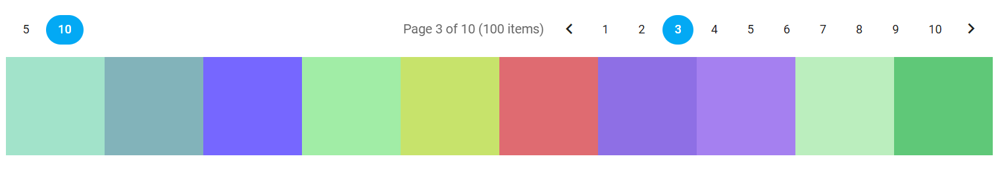

<!-- default badges list -->

<!-- default badges end -->
# DevExtreme Pagination - Getting Started

This repository stores code for the following DevExpress tutorial: [Getting Started with DevExtreme Pagination](https://js.devexpress.com/Documentation/Guide/UI_Components/Pagination/Getting_Started_with_Pagination/). The project creates a UI component that allows users to navigate through pages.

## Files to Review

- **jQuery**
    - [index.js](jQuery/src/index.js)
- **Angular**
    - [app.component.html](Angular/src/app/app.component.html)
    - [app.component.ts](Angular/src/app/app.component.ts)
- **Vue**
    - [Home.vue](Vue/src/components/HomeContent.vue)
- **React**
    - [App.js](React/src/App.js)

## Documentation

- [Getting Started with Pagination](https://js.devexpress.com/Documentation/Guide/UI_Components/Pagination/Getting_Started_with_Pagination/)
- [Pagination - API Reference](https://js.devexpress.com/Documentation/ApiReference/UI_Components/dxPagination/)
<!-- feedback -->
## Does this example address your development requirements/objectives?

 

(you will be redirected to DevExpress.com to submit your response)
<!-- feedback end -->
